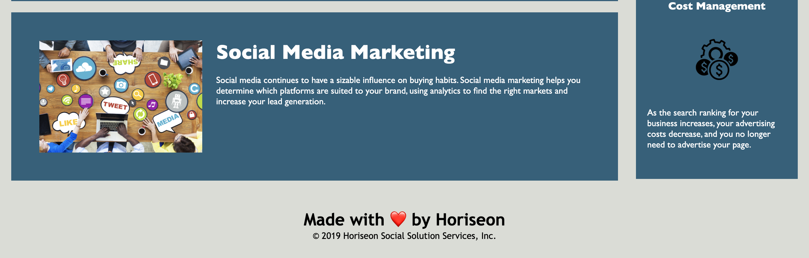

# Horiseon-Refactor
Description:

Refactoring code is improving the code structure to meet accesiblity standards without chaning what the code is meant to do. In this assignment I believe I accomplished that through: 

  - the use of semantic HTML elements
  
  - making sure elements follow a logical structure independent of styling and positioning
  
  - having accessible alt attributes
  
  - heading attributes falling in sequential order

I definitely think I applied Scout's Rule here. Everything works the same as before but with some new features. The webpage is now uniform, there is only one shade of blue instead of three. The  application's links function properly and all of the pictures have alt tags, emphasizing the importance of web accessibilty. 

Screenshots of finalized application:

